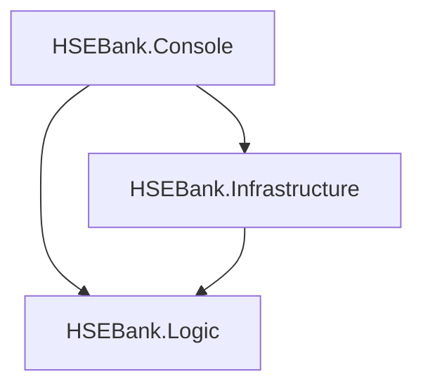

# HSEBank.Finance

Консольное приложение на **C# / .NET 8** для учёта личных финансов. Позволяет создавать счета и категории, добавлять и редактировать операции, получать аналитику и работать с CSV/JSON.

Учебный проект по конструированию программного обеспечения с разделением на слои, внедрением зависимостей и применением паттернов проектирования.

## Возможности

- Создание счетов с начальным балансом и просмотр текущего баланса.
- Создание категорий доходов и расходов.
- Добавление и редактирование операций через консольное меню.
- Проверка достаточности средств при ручном добавлении и редактировании расходов.
- Проверка будущих дат при ручном вводе операций.
- Импорт операций из CSV и JSON, экспорт в отдельные файлы.
- Аналитика доходов, расходов и итога за период с группировкой по категориям.

## Быстрый запуск

Требования: **.NET SDK 8.0** и Git. База данных и внешние сервисы не требуются.

```bash
git clone https://github.com/elinakocharyan777/HSE-Bank-finance.git hsebank-finance
cd hsebank-finance
dotnet restore HSEBank.Finance.sln
dotnet build HSEBank.Finance.sln -c Release
dotnet run --project HSEBank.Console -c Release --no-build
```

## Пример работы

1. Выбери `1` и создай счёт `Demo` с начальным балансом `0`.
2. Выбери `4`, затем номер счёта и путь `examples/operations.csv`.
3. Программа импортирует две операции: доход `100` и расход `30`.
4. Выбери `8`: баланс счёта должен составить `70`.
5. Выбери `9`, счёт и период `2025-01-01` — `2025-01-31`: доход `100`, расход `30`, итог `70`.
6. Выбери `0` для завершения.

Пример результата (идентификатор счёта зависит от запуска):

```text
Импортировано: 2
… | Demo | Баланс: 70
Доход:  100
Расход: 30
Итог:   70
```

## Импорт и экспорт

Готовые примеры: [CSV](examples/operations.csv) и [JSON](examples/operations.json). Импортируй один из них в новый счёт: повторный импорт добавляет операции повторно.

CSV использует заголовок и порядок полей:

```csv
type,category,amount,date,description
Income,Salary,100,2025-01-15,Demo income
Expense,Food,30,2025-01-16,Demo expense
```

В JSON текущий импортёр ожидает числовой тип: `1` — доход, `2` — расход.

```json
[
  {"type": 1, "category": "Salary", "amount": 100, "date": "2025-01-15", "description": "Demo income"},
  {"type": 2, "category": "Food", "amount": 30, "date": "2025-01-16", "description": "Demo expense"}
]
```

Экспорт создаёт `export-ops.csv` или `export-ops.json` в рабочей папке. Эти файлы предназначены для просмотра операций: их текущая структура отличается от структуры импорта, поэтому обратный импорт не восстанавливает операции. CSV-парсер использует простое разделение по запятым; запятые внутри полей не поддерживаются.

## Архитектура



| Проект | Ответственность |
|---|---|
| `HSEBank.Console` | Меню, ввод, вывод и регистрация зависимостей |
| `HSEBank.Logic` | Сущности, фасады, операции, аналитика, импорт и экспорт |
| `HSEBank.Infrastructure` | Хранилище в памяти и кэширующий прокси |

Применённые подходы:

| Паттерн / подход | Пример |
|---|---|
| Facade | `AccountFacade`, `CategoryFacade`, `OperationFacade` |
| Factory | Создание счетов, категорий и операций |
| Command | Команды создания счёта, добавления операции и пересчёта |
| Decorator | `TimedCommand` для измерения длительности |
| Template Method | Общая последовательность импорта |
| Visitor | Экспорт операций в CSV и JSON |
| Proxy | `CachingRepositoryProxy` |
| Chain of Responsibility | Цепочка проверки импортируемых строк |
| Repository и DI | Контракты хранилищ и внедрение зависимостей |

## Структура

```text
HSEBank.Finance.sln
HSEBank.Console/
HSEBank.Logic/
HSEBank.Infrastructure/
examples/                    # Проверенные входные CSV/JSON
docs/                        # Документация и результаты проверки
```

## Хранение данных и известные ограничения

Данные находятся в памяти и исчезают после завершения программы. Экспорт не является полным резервным копированием счетов и категорий.

В исходной учебной реализации обнаружены ошибки, которые пока не исправлены:

- Пересчёт баланса учитывает только операции и теряет начальный баланс счёта.
- При редактировании операции на сумму `0` баланс изменяется до возникновения ошибки проверки, хотя сама операция остаётся прежней.
- Экспортированные CSV/JSON не совместимы с текущими импортёрами.
- Проверка недостатка средств находится в консольном сценарии; импорт не обеспечивает такую же проверку. Импорт также не является атомарной операцией.

Подробности и фактические результаты: [проверка проекта](docs/verification.md). Автоматизированных тестов и CI в текущей версии нет. Приоритеты доработки: целостность баланса, единая проверка операций, совместимость импорта/экспорта, затем регрессионные тесты.

